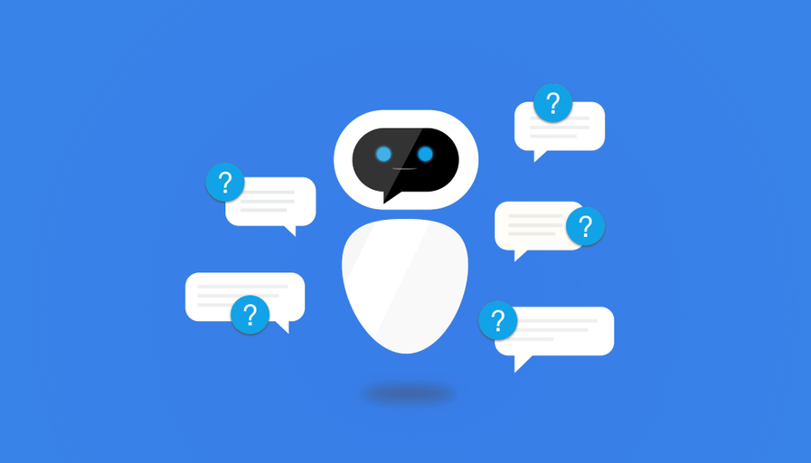

# Chatbot

A chatbot is an AI-powered program that you can “chat with.” Many businesses have already considered the use of these “virtual assistants” for customer service or tech support purposes, because they make it easy to answer user queries in real-time through a messaging platform using the power of machine learning.

Chatbots typically integrate with messaging apps such as Facebook Messenger and websites popups.

## What is DialogFlow?

Natural language understanding (NLU) has always been a painful part while building a chatbot. How do you make sure your bot is actually understanding what the user says, and parsing their requests correctly? Well, here’s where DialogFlow comes in and fills the gap. It actually replaces the NLU parsing bit so that you can focus on other areas like your business logic!

DialogFlow is simply a tool that allows you to make bots (or assistants or agents) that understand human conversation, string together a meaningful API call with appropriate parameters after parsing the conversation and respond with an adequate reply. You can then deploy this bot to any platform of your choosing — Facebook Messenger, Slack, Google Assistant, Twitter, Skype, etc. Or on your own app or website as well!