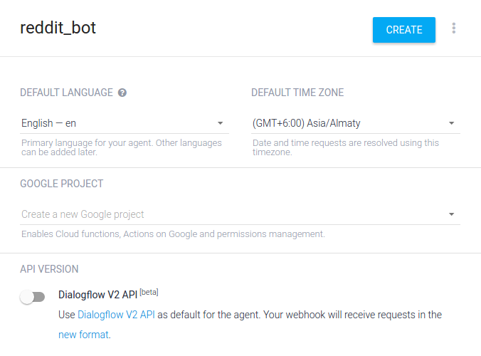

# Making a Reddit chatbot using DialogFlow
Now that we’re well equipped with the basics, let’s get started! We’re going to make a Reddit bot that tells a joke or an interesting fact from the day’s top threads on specific subreddits. We’ll also sprinkle in some context awareness so that the bot doesn’t feel “rigid”.
NOTE: You would need a billing-enabled account on Google Cloud Platform(GCP) if you want to follow along with this tutorial. It’s free and just needs your credit card details to set up

## Creating an Agent
1. Log in to the DialogFlow dashboard using your Google account. [Here’s the link.](https://console.dialogflow.com/api-client/#/login)
2. Click on “Create Agent”
3. Enter the details as below, and hit “Create”. You can select any other Google project if it has billing enabled on it as well.

