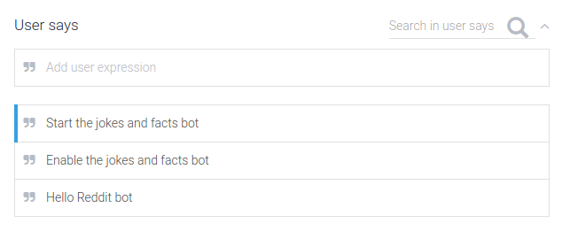
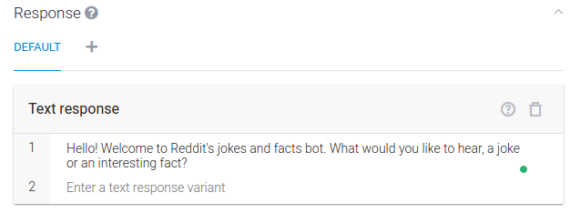

# Setting up a “Welcome” Intent
As soon as you create the agent, you see this intents page:

The “Default Fallback” Intent exists in case the user says something unexpected and is outside the scope of your intents. We won’t worry too much about that right now. Go ahead and click on the “Default Welcome Intent”. We can notice a lot of options that we can tweak.
Let’s start with a triggering phrase. Notice the “User Says” section? We want our bot to activate as soon as we say something along the lines of:

Let’s fill that in. After that, scroll down to the “Responses” tab. You can see some generic welcome messages are provided. Get rid of them, and put in something more personalized to our bot, as follows:

Now, this does a couple of things. Firstly, it lets the user know that they’re using our bot. It also guides the user to the next point in the conversation. Here, it is an “or” question.

Hit “Save” and let’s move on.