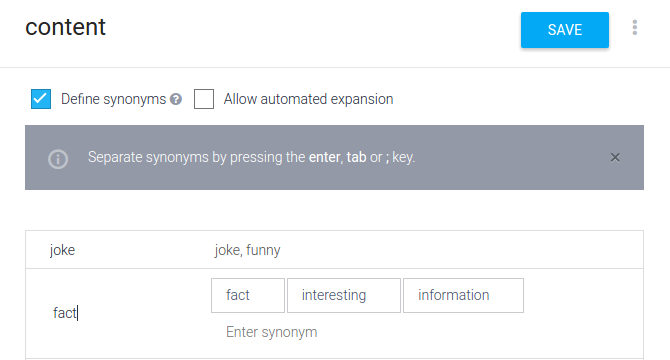

# Creating a Custom Entity

Before we start playing around with Intents, I want to set up a Custom Entity real quick. If you remember, Entities are what we extract from user’s input to process further. I’m going to call our Entity “content”. As the user request will be content — either a joke or a fact. Let’s go ahead and create that. Click on the “Entities” tab on left-sidebar and click “Create Entity”.

Fill in the following details:

As you can see, we have 2 values possible for our content: “joke” and “fact”. We also have entered synonyms for each of them, so that if the user says something like “I want to hear something funny”, we know he wants a “joke” content. Click “Save” and let’s proceed to the next section!

