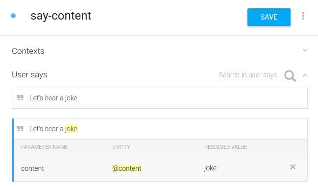
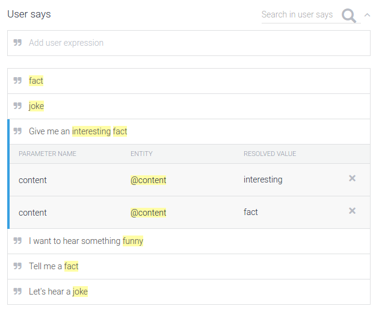
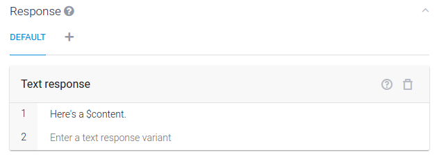
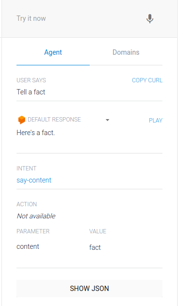

# Attaching our new Entity to the Intent

Create a new Intent called “say-content”. Add the phrase “Let’s hear a joke” in the “User Says” section, like so:

Right off the bat, we notice a couple of interesting things. Dialogflow parsed this input and associated the entity content to it, with the correct value (here, “joke”). Let’s add a few more inputs:

PS: Make sure all the highlighted words are in the same color and have associated the same entity. Dialogflow’s NLU isn’t perfect and sometimes assigns different Entities. If that’s the case, just remove it, double-click the word and assign the correct Entity yourself!

Let’s add a placeholder text response to see it work. To do that, scroll to the bottom section “Response”, and fill it like so:

The “$content” is a variable having a value extracted from user’s response that we saw above.

Let’s see this in action. On the right side of every page on Dialogflow’s platform, you see a “Try It Now” box. Use that to test your work at any point in time. I’m going to go ahead and type in “Tell a fact” in the box. Notice that the “Tell a fact” phrase wasn’t present in the samples that we gave earlier. Dialogflow keeps training using it’s NLU modules and can extract data from similarly structured sentences:

