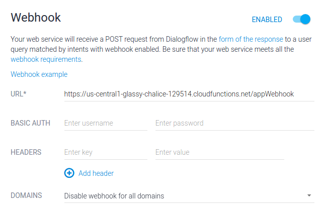
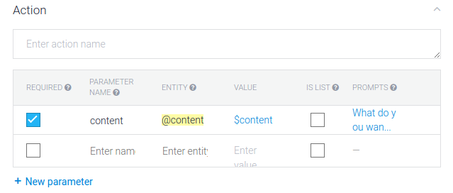
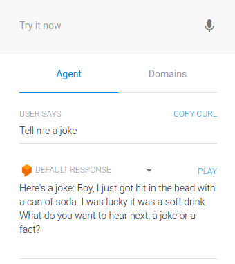

# A Webhook to process requests

To keep things simple I’m gonna write a JS app that fulfills the request by querying the Reddit’s website and returning the appropriate content. Luckily for us, Reddit doesn’t need authentication to read in JSON format. Here’s the code:

```js
'use strict';
const http = require('https');
exports.appWebhook = (req, res) => {
 let content = req.body.result.parameters['content'];
 getContent(content).then((output) => {
   res.setHeader('Content-Type', 'application/json');
   res.send(JSON.stringify({ 'speech': output, 'displayText': output    }));
 }).catch((error) => {
   // If there is an error let the user know
   res.setHeader('Content-Type', 'application/json');
   res.send(JSON.stringify({ 'speech': error, 'displayText': error     }));
 });
};
function getSubreddit (content) {
 if (content == "funny" || content == "joke" || content == "laugh")
   return {sub: "jokes", displayText: "joke"};
   else {
     return {sub: "todayILearned", displayText: "fact"};
   }
}
function getContent (content) {
 let subReddit = getSubreddit(content);
 return new Promise((resolve, reject) => {
   console.log('API Request: to Reddit');
   http.get(`https://www.reddit.com/r/${subReddit["sub"]}/top.json?sort=top&t=day`, (resp) => {
     let data = '';
     resp.on('data', (chunk) => {
       data += chunk;
     });
     resp.on('end', () => {
       let response = JSON.parse(data);
       let thread = response["data"]["children"][(Math.floor((Math.random() * 24) + 1))]["data"];
       let output = `Here's a ${subReddit["displayText"]}: ${thread["title"]}`;
       if (subReddit['sub'] == "jokes") {
         output += " " + thread["selftext"];
       }
       output += "\nWhat do you want to hear next, a joke or a fact?"
       console.log(output);
       resolve(output);
     });
   }).on("error", (err) => {
     console.log("Error: " + err.message);
     reject(error);
   });
 });
}
```

Now, before going ahead, follow the steps 1–5 mentioned [here](https://cloud.google.com/functions/docs/quickstart) religiously.

NOTE: For step 1, select the same Google Project that you created/used, when creating the agent.

Now, to deploy our function using gcloud:
*$ gcloud beta functions deploy appWebHook — stage-bucket BUCKET_NAME — trigger-http*

To find the BUCKET_NAME, go to your Google project’s console and click on Cloud Storage under the Resources section.

After you run the command, make note of the *httpsTrigger* URL mentioned. On the Dialoglow platform, find the “Fulfilment” tab on the sidebar. We need to enable webhooks and paste in the URL, like this:



Hit “Done” on the bottom of the page, and now the final step. Visit the “say_content” Intent page and perform a couple of steps.

1. Make the “content” parameter mandatory. This will make the bot ask explicitly for the parameter to the user if it’s not clear:

   

2. Notice a new section has been added to the bottom of the screen called “Fulfilment”. Enable the “Use webhook” checkbox:

   

3. Click “Save” and that’s it! Time to test this Intent out!

   

   Reddit’s crappy humor aside, this looks neat. Our replies always drive the conversation to places (Intents) that we want it to.

