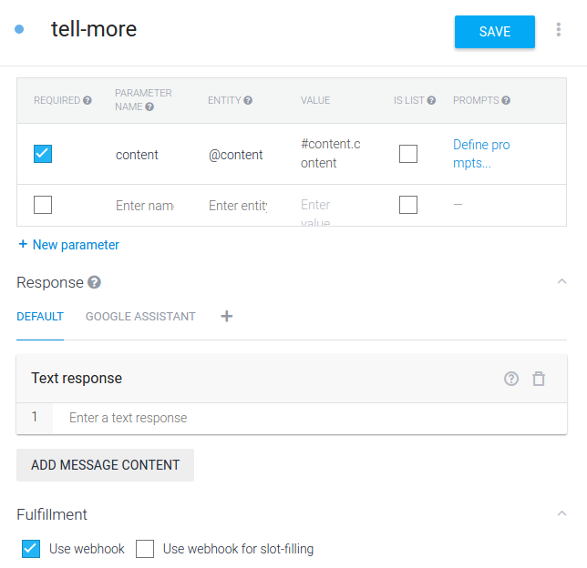

# Adding Context to our Bot

Even though this works perfectly fine, there’s one more thing I’d like to add quickly. We want the user to be able to say, “More” or “Give me another one” and the bot to be able to understand what this means. This is done by emitting and absorbing contexts between intents.

First, to emit the context, scroll up on the “say-content” Intent’s page and find the “Contexts” section. We want to output the “context”. Let’s say for a count of 5. The count makes sure the bot remembers what the “content” is in the current conversation for up to 5 back and forths.

Now, we want to create new content that can absorb this type of context and make sense of phrases like “More please”:

Finally, since we want it to work the same way, we’ll make the Action and Fulfilment sections look the same way as the “say-content” Intent does:

And that’s it! **Your bot is ready!!**