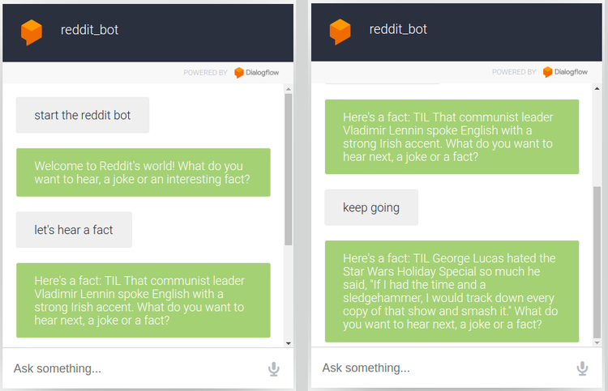
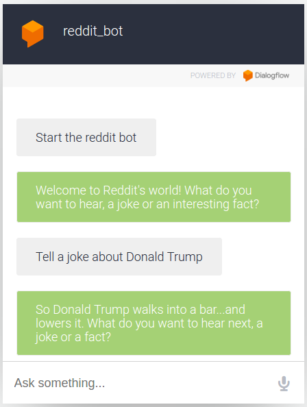

# Integrations

Dialogflow provides integrations with probably every messaging service in Silicon Valley, and more. But we’ll use the Web Demo. Go to “Integrations” tab from the sidebar and enable “Web Demo” settings. Your bot should work like this:

And that’s it! Your bot is ready to face a real person! Now, you can easily keep adding more subreddits, like news, sports, bodypainting, dankmemes or whatever your hobbies in life are! Or make it understand a few more parameters. For example, “A joke about Donald Trump”.

Consider that your homework. You can also add a “Bye” intent, and make the bot stop. Our bot currently isn’t so great with goodbyes, sort of like real people.

